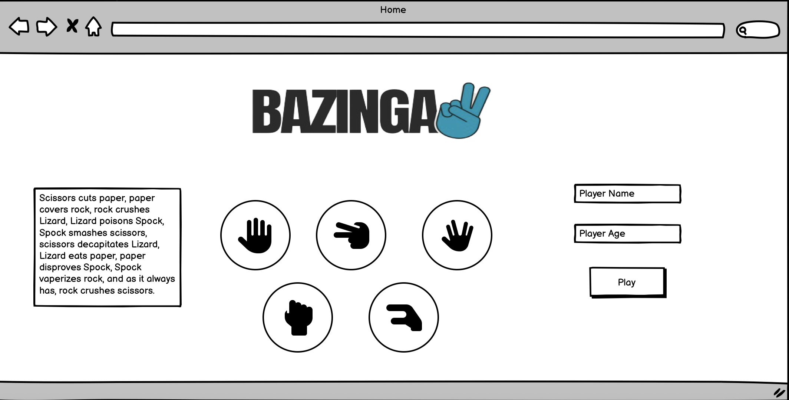
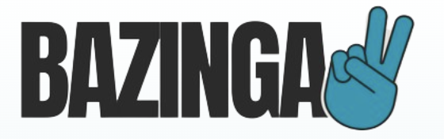
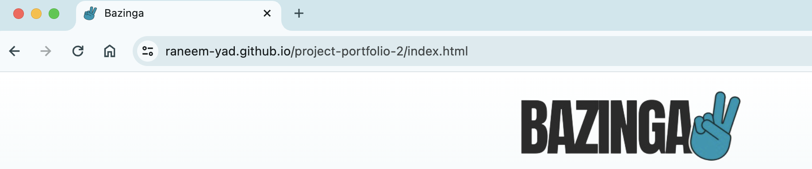
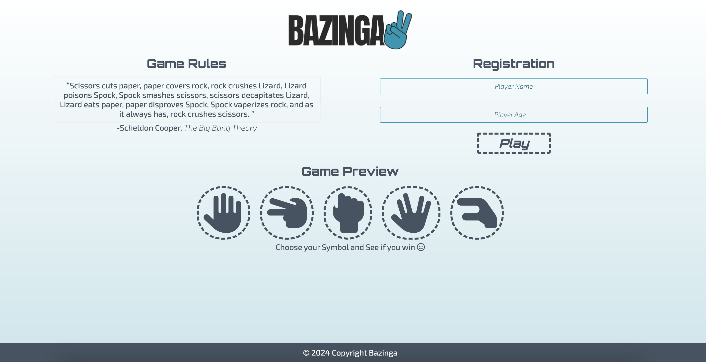
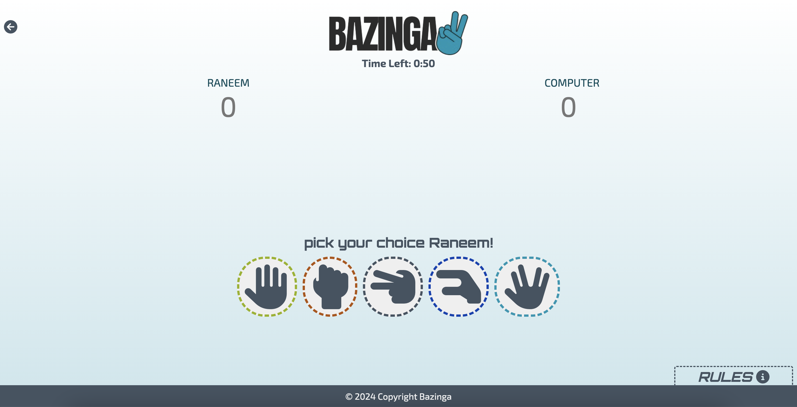
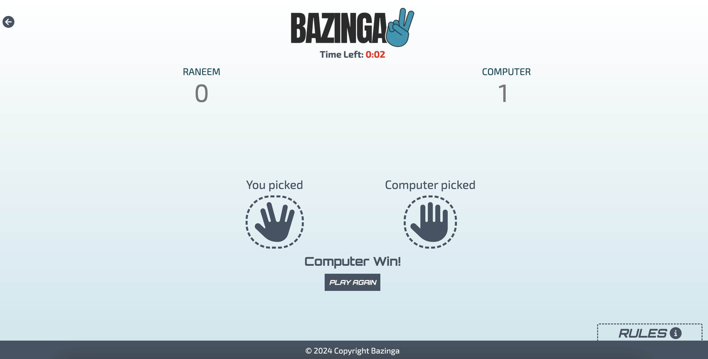
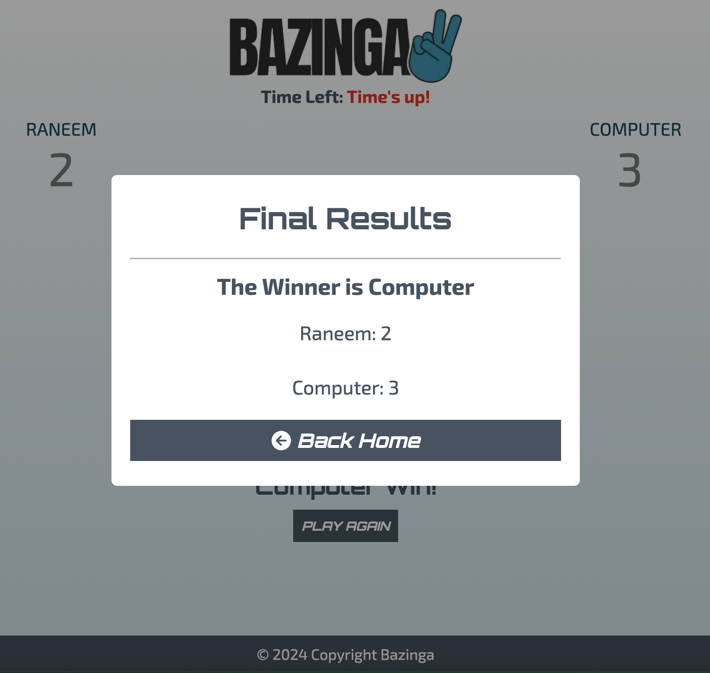

<h1 align="center"><a name="top">Bazinga Website</a></h1>

[View the live project here.](https://raneem-yad.github.io/project-portfolio-2/) 

 Welcome to Bazinga, the ultimate destination for playing the famous game of Rock, Paper, Scissors, Lizard, and Spock! Inspired by Sheldon Cooper's iconic quote from The Big Bang Theory, this website offers an interactive and entertaining experience for players of all ages.

Bazinga brings the popular game to life with a twist, incorporating Sheldon's favorite variations - Lizard and Spock. The website features two main pages designed to provide both amusement and engagement for users.

<h2 align="center"></h2>

## User Experience (UX)

*   ### User stories

    -   ####  Visitor Goals

        1. As a visitor, I want to read Sheldon Cooper's famous quote from The Big Bang Theory on the homepage.
        2. As a visitor, I want to see the different elements of the game (Rock, Paper, Scissors, Lizard, Spock) explained clearly on the homepage.
        3. As a visitor, I want the website to be visually appealing and easy to navigate.

    -   ####  Player Goals
        1. As a player, I want to register for the game by providing my name and age.
        2. As a player, I want to ensure that the registration process only accepts ages between 10 and 85.
        3. As a player, I want to navigate to the game page from the homepage.
        4. As a player, I want to see a timer of one minute displayed prominently on the game page.
        5. As a player, I want to be able to select my choice (Rock, Paper, Scissors, Lizard, Spock) within the given time frame.
        6. As a player, I want to see my choice and the computer's choice revealed after making my selection.
        7. As a player, I want to see the result of the game (win, lose, or draw) displayed dynamically with animations.
        8. As a player, I want to accumulate points for each game I win.
        9. As a player, I want the option to return to the homepage or review the game rules after completing a game.
        10. As a player, I want to receive a modal notification when the game timer runs out, displaying the final result and scores.
        11. As a player, I want the option to return to the homepage from the modal notification.

 

*   ### <a name="design">Design</a>
  
    -   #### Colour Scheme
        -   The three main colors used are :
            - Primary Color (#445361).
            - Secondary Color(#0097B2).
        

        These colors were selected to provide a visual appeal to the website.

    -   #### Typography
        -   Bazinga utilizes the following font styles to enhance the gaming experience:
            -   Exo 2: This font style is chosen for its modern and sleek appearance, adding a contemporary touch to the website's text elements.
            -   Orbitron: Orbitron font complements the gaming theme of the website with its bold and futuristic design, adding emphasis and impact to headings and titles.

  
    -   #### Imagery
        -   While Bazinga primarily focuses on delivering an engaging gaming experience, imagery is intentionally kept minimal to maintain a clean and distraction-free interface. The website relies on colors, typography, and interactive elements to capture the attention of visitors and immerse them in the game environment.
       
  
    

*   ### <a name="wireframes">Wireframes</a>
    -   Home Page Wireframe
              
       
    -   Play Page Wireframe
              
 
      The mockups may differ slightly from the actual website as certain features were added, modified, or removed during discussions and implementation.
     
    

 

## Features

### Sitewide
* Logo
     * The website features a distinctive logo that represents the Bazinga brand and enhances brand recognition across the site.

* Favicon
    * The Website has Favicon which will provide an image in the the tabs header to allow the user to easily identify the website if they have multiple tabs open.

### Landing Page
* The landing page prominently displays Sheldon Cooper's quote from The Big Bang Theory, adding a touch of humor and familiarity for visitors.
* Visitors can explore a detailed explanation of the game elements, including Rock, Paper, Scissors, Lizard, and Spock, to understand the game mechanics.
* A user-friendly registration form allows players to sign up by providing their name and age, ensuring a personalized gaming experience.
    

### Playing Page
* The playing page features a timer functionality, adding excitement and challenge to the gameplay with a one-minute countdown, when the time is less than 10, it turns to red color to make the user pay more attention.

  
* Real-time updates of the player's and computer's choices are displayed dynamically during gameplay, enhancing user engagement.

  
* Animated transitions and effects accompany the reveal of game results, providing an immersive gaming experience.
The website tracks and displays scores for each player, adding a competitive element to the gameplay.

 
    

###   Responsive on all device sizes

- Bazinga is designed to be fully responsive, ensuring optimal viewing and functionality across various devices, including desktops, tablets, and smartphones.
  

###   Interactive elements

- Gameplay Interaction: Players can actively participate in the game by selecting their choice (Rock, Paper, Scissors, Lizard, Spock) within the given time frame. This interaction drives the core gameplay experience.

- Real-time Updates: The website dynamically updates and displays the player's and computer's choices during gameplay, keeping users informed and engaged with the evolving game state.
- Animated Transitions: Animated transitions and effects accompany the reveal of game results, adding excitement and visual interest to the gaming experience.
- User Registration: The registration form on the landing page allows users to sign up by providing their name and age, facilitating personalized interactions within the gaming environment.
- Score Tracking: Bazinga tracks and displays scores for each player, providing feedback and motivation for continued engagement and improvement.

###   Future Features
- Continued development may include integration of social media sharing options to allow players to challenge friends and share their gaming experiences.
- Enhanced user profiles with customizable avatars could be introduced to add a personal touch to the gaming experience.
- Implementation of leaderboards to showcase top players and their scores may be considered to foster competition and community engagement.

## Technologies Used

### Languages Used

-   [HTML5](https://en.wikipedia.org/wiki/HTML5)
-   [CSS3](https://en.wikipedia.org/wiki/Cascading_Style_Sheets)
-   [Javascript](https://en.wikipedia.org/wiki/JavaScript)

### Frameworks, Libraries & Programs Used

1. [Google Fonts:](https://fonts.google.com/)
    - Google fonts were used to import the 'Titillium Web' font into the style.css file which is used on all pages throughout the project.
2. [Font Awesome:](https://fontawesome.com/)
    - Font Awesome was used on all pages throughout the website to add icons for aesthetic and UX purposes.
3. [Git](https://git-scm.com/)
    - Git was used for version control by utilizing the Gitpod terminal to commit to Git and Push to GitHub.
4. [GitHub:](https://github.com/)
    - GitHub is used to store the project's code after being pushed from Git.
5. [balsamiq:](https://balsamiq.com/)
    - Balsamiq was used to create the wireframes.
6. [VS Code:](https://code.visualstudio.com/)
    - Visual Studio Code was used as IDE.
      

 
