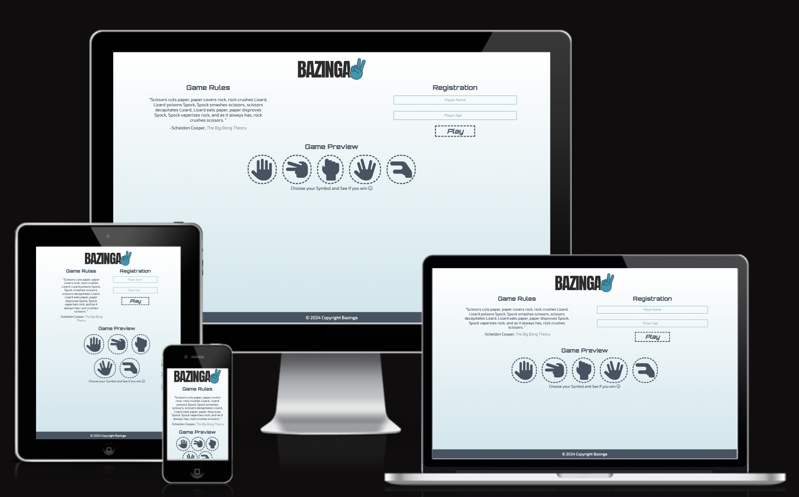

<h1 align="center"><a name="top">Bazinga Website</a></h1>

[View the live project here.](https://raneem-yad.github.io/project-portfolio-2/) 

 Welcome to Bazinga, the ultimate destination for playing the famous game of Rock, Paper, Scissors, Lizard, and Spock! Inspired by Sheldon Cooper's iconic quote from The Big Bang Theory, this website offers an interactive and entertaining experience for players of all ages.

Bazinga brings the popular game to life with a twist, incorporating Sheldon's favorite variations - Lizard and Spock. The website features two main pages designed to provide both amusement and engagement for users.

<h2 align="center"></h2>

## User Experience (UX)

*   ### User stories

    -   ####  Visitor Goals

        1. As a visitor, I want to read Sheldon Cooper's famous quote from The Big Bang Theory on the homepage.
        2. As a visitor, I want to see the different elements of the game (Rock, Paper, Scissors, Lizard, Spock) explained clearly on the homepage.
        3. As a visitor, I want the website to be visually appealing and easy to navigate.

    -   ####  Player Goals
        1. As a player, I want to register for the game by providing my name and age.
        2. As a player, I want to ensure that the registration process only accepts ages between 10 and 85.
        3. As a player, I want to navigate to the game page from the homepage.
        4. As a player, I want to see a timer of one minute displayed prominently on the game page.
        5. As a player, I want to be able to select my choice (Rock, Paper, Scissors, Lizard, Spock) within the given time frame.
        6. As a player, I want to see my choice and the computer's choice revealed after making my selection.
        7. As a player, I want to see the result of the game (win, lose, or draw) displayed dynamically with animations.
        8. As a player, I want to accumulate points for each game I win.
        9. As a player, I want the option to return to the homepage or review the game rules after completing a game.
        10. As a player, I want to receive a modal notification when the game timer runs out, displaying the final result and scores.
        11. As a player, I want the option to return to the homepage from the modal notification.

 

*   ### <a name="design">Design</a>
  
    -   #### Colour Scheme
        -   The three main colors used are :
            - Primary Color (#445361).
            - Secondary Color(#0097B2).
        

        These colors were selected to provide a visual appeal to the website.

    -   #### Typography
        -   Bazinga utilizes the following font styles to enhance the gaming experience:
            -   Exo 2: This font style is chosen for its modern and sleek appearance, adding a contemporary touch to the website's text elements.
            -   Orbitron: Orbitron font complements the gaming theme of the website with its bold and futuristic design, adding emphasis and impact to headings and titles.

  
    -   #### Imagery
        -   While Bazinga primarily focuses on delivering an engaging gaming experience, imagery is intentionally kept minimal to maintain a clean and distraction-free interface. The website relies on colors, typography, and interactive elements to capture the attention of visitors and immerse them in the game environment.
       
  
    
