<h1 align="center"><a name="top">Bazinga Website</a></h1>

[View the live project here.](https://raneem-yad.github.io/project-portfolio-2/) 

 Welcome to Bazinga, the ultimate destination for playing the famous game of Rock, Paper, Scissors, Lizard, and Spock! Inspired by Sheldon Cooper's iconic quote from The Big Bang Theory, this website offers an interactive and entertaining experience for players of all ages.

Bazinga brings the popular game to life with a twist, incorporating Sheldon's favorite variations - Lizard and Spock. The website features two main pages designed to provide both amusement and engagement for users.

<h2 align="center"></h2>

## User Experience (UX)

*   ### User stories

    -   ####  Visitor Goals

        1. As a visitor, I want to read Sheldon Cooper's famous quote from The Big Bang Theory on the homepage.
        2. As a visitor, I want to see the different elements of the game (Rock, Paper, Scissors, Lizard, Spock) explained clearly on the homepage.
        3. As a visitor, I want the website to be visually appealing and easy to navigate.

    -   ####  Player Goals
        1. As a player, I want to register for the game by providing my name and age.
        2. As a player, I want to ensure that the registration process only accepts ages between 10 and 85.
        3. As a player, I want to navigate to the game page from the homepage.
        4. As a player, I want to see a timer of one minute displayed prominently on the game page.
        5. As a player, I want to be able to select my choice (Rock, Paper, Scissors, Lizard, Spock) within the given time frame.
        6. As a player, I want to see my choice and the computer's choice revealed after making my selection.
        7. As a player, I want to see the result of the game (win, lose, or draw) displayed dynamically with animations.
        8. As a player, I want to accumulate points for each game I win.
        9. As a player, I want the option to return to the homepage or review the game rules after completing a game.
        10. As a player, I want to receive a modal notification when the game timer runs out, displaying the final result and scores.
        11. As a player, I want the option to return to the homepage from the modal notification.

 

*   ### <a name="design">Design</a>
  
    -   #### Colour Scheme
        -   The three main colors used are :
            - Primary Color (#445361).
            - Secondary Color(#0097B2).
        

        These colors were selected to provide a visual appeal to the website.

    -   #### Typography
        -   Bazinga utilizes the following font styles to enhance the gaming experience:
            -   Exo 2: This font style is chosen for its modern and sleek appearance, adding a contemporary touch to the website's text elements.
            -   Orbitron: Orbitron font complements the gaming theme of the website with its bold and futuristic design, adding emphasis and impact to headings and titles.

  
    -   #### Imagery
        -   While Bazinga primarily focuses on delivering an engaging gaming experience, imagery is intentionally kept minimal to maintain a clean and distraction-free interface. The website relies on colors, typography, and interactive elements to capture the attention of visitors and immerse them in the game environment.
       
  
    

*   ### <a name="wireframes">Wireframes</a>
    -   Home Page Wireframe
               
       
    -   Play Page Wireframe
              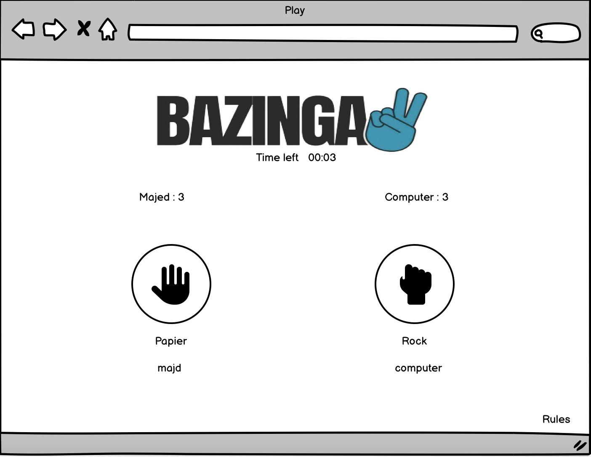
 
      The mockups may differ slightly from the actual website as certain features were added, modified, or removed during discussions and implementation.
     
    

 

## Features

### Sitewide
* Logo
     * The website features a distinctive logo that represents the Bazinga brand and enhances brand recognition across the site.

* Favicon
    * The Website has Favicon which will provide an image in the the tabs header to allow the user to easily identify the website if they have multiple tabs open.

### Landing Page
* The landing page prominently displays Sheldon Cooper's quote from The Big Bang Theory, adding a touch of humor and familiarity for visitors.
* Visitors can explore a detailed explanation of the game elements, including Rock, Paper, Scissors, Lizard, and Spock, to understand the game mechanics.
* A user-friendly registration form allows players to sign up by providing their name and age, ensuring a personalized gaming experience.
    

### Playing Page
* The playing page features a timer functionality, adding excitement and challenge to the gameplay with a one-minute countdown, when the time is less than 10, it turns to red color to make the user pay more attention.

  
* Real-time updates of the player's and computer's choices are displayed dynamically during gameplay, enhancing user engagement.

  
* Animated transitions and effects accompany the reveal of game results, providing an immersive gaming experience.
The website tracks and displays scores for each player, adding a competitive element to the gameplay.

* When the Time is up, a popup window will show the final results
  <h2></h2>

    

###   Responsive on all device sizes

- Bazinga is designed to be fully responsive, ensuring optimal viewing and functionality across various devices, including desktops, tablets, and smartphones.
  

###   Interactive elements

- Gameplay Interaction: Players can actively participate in the game by selecting their choice (Rock, Paper, Scissors, Lizard, Spock) within the given time frame. This interaction drives the core gameplay experience.

- Real-time Updates: The website dynamically updates and displays the player's and computer's choices during gameplay, keeping users informed and engaged with the evolving game state.
- Animated Transitions: Animated transitions and effects accompany the reveal of game results, adding excitement and visual interest to the gaming experience.
- User Registration: The registration form on the landing page allows users to sign up by providing their name and age, facilitating personalized interactions within the gaming environment.
- Score Tracking: Bazinga tracks and displays scores for each player, providing feedback and motivation for continued engagement and improvement.

###   Future Features
- Continued development may include integration of social media sharing options to allow players to challenge friends and share their gaming experiences.
- Enhanced user profiles with customizable avatars could be introduced to add a personal touch to the gaming experience.
- Implementation of leaderboards to showcase top players and their scores may be considered to foster competition and community engagement.

## Technologies Used

### Languages Used

-   [HTML5](https://en.wikipedia.org/wiki/HTML5)
-   [CSS3](https://en.wikipedia.org/wiki/Cascading_Style_Sheets)
-   [Javascript](https://en.wikipedia.org/wiki/JavaScript)

### Frameworks, Libraries & Programs Used

1. [Google Fonts:](https://fonts.google.com/)
    - Google fonts were used to import the 'Titillium Web' font into the style.css file which is used on all pages throughout the project.
2. [Font Awesome:](https://fontawesome.com/)
    - Font Awesome was used on all pages throughout the website to add icons for aesthetic and UX purposes.
3. [Git](https://git-scm.com/)
    - Git was used for version control by utilizing the Gitpod terminal to commit to Git and Push to GitHub.
4. [GitHub:](https://github.com/)
    - GitHub is used to store the project's code after being pushed from Git.
5. [balsamiq:](https://balsamiq.com/)
    - Balsamiq was used to create the wireframes.
6. [VS Code:](https://code.visualstudio.com/)
    - Visual Studio Code was used as IDE.
      

 

## Testing

### General Testing

html-validator.png
1. The W3C Markup Validator and W3C CSS Validator services were used to validate every page of the project to ensure there were no syntax errors in the project.
    - [W3C Markup Validator](https://validator.w3.org/#validate_by_input) - [Results: index.html Page]
      <h2>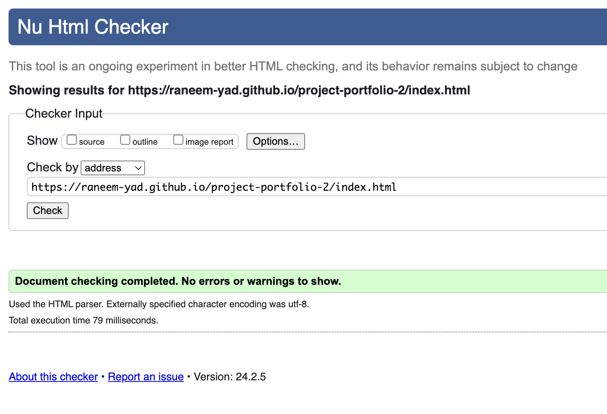</h2>
      
    - [W3C Markup Validator](https://validator.w3.org/#validate_by_input) - [Results: play.html Page]
      <h2>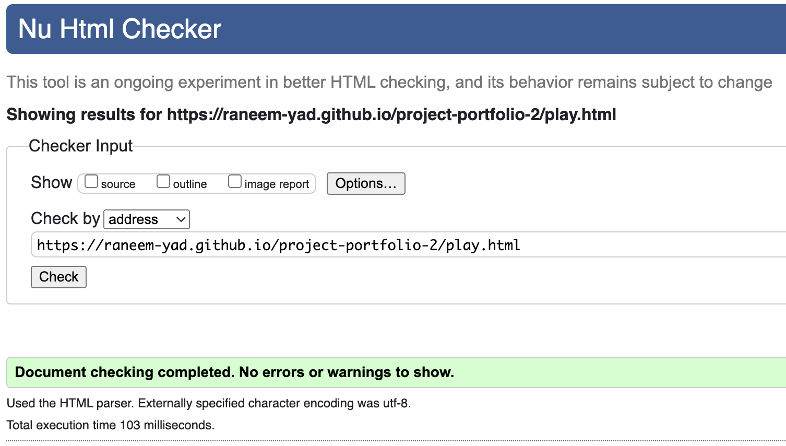</h2>

    - [W3C CSS Validator](https://jigsaw.w3.org/css-validator/#validate_by_input) - [Results: index.html Page]
    <h2>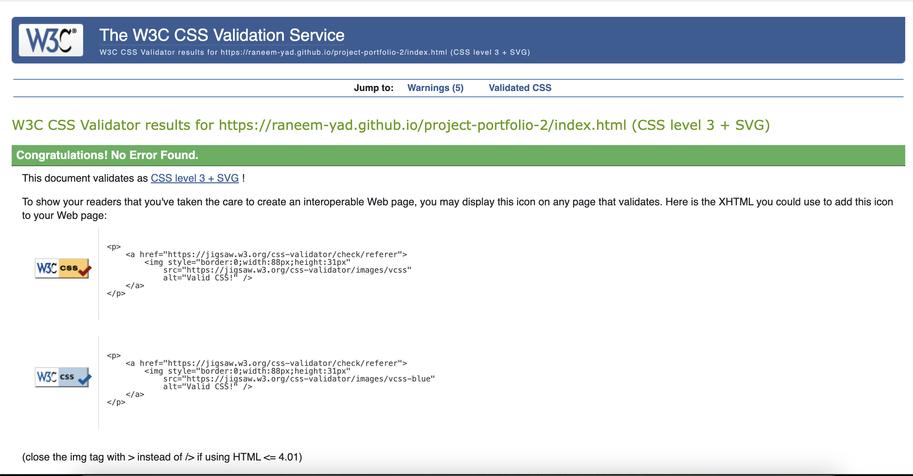</h2>
    
    - [W3C CSS Validator](https://jigsaw.w3.org/css-validator/#validate_by_input) - [Results: play.html Page]
    <h2>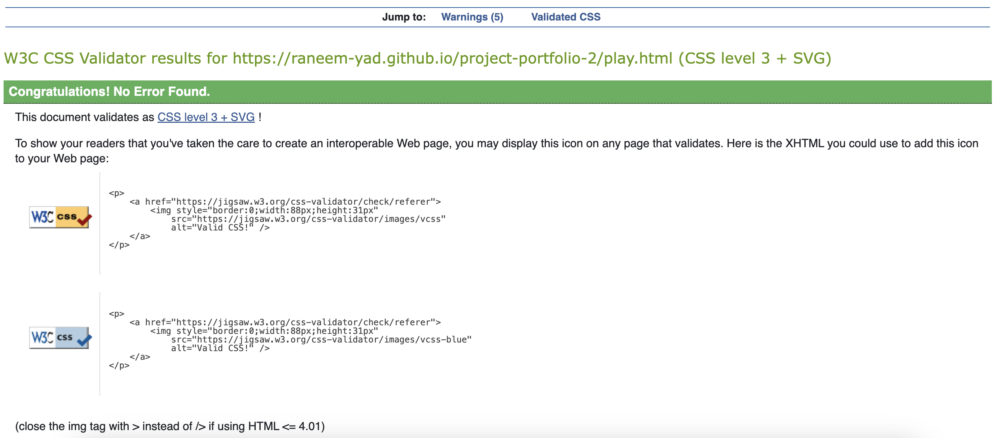</h2>

2. JSHint, a JavaScript Code Quality Tool:
    - JSHint is a static code analysis tool used in software development for checking if JavaScript source code complies with coding rules.
    <h2></h2>
    
3. Resolution and Scaling were tested with Google Dev tools on Galaxy Fold, 280px to ensure the website works flawlessly on all resolutions 280px and above.

      - For a view of the Page on different devices, the Picture at the [Top](#top) of the Page has a good overview. The following are examples of resolution screenshots, emulating different sizes on Google Chrome/Mac OS.
        1.  Landing Page iPad Resolution
            <h2>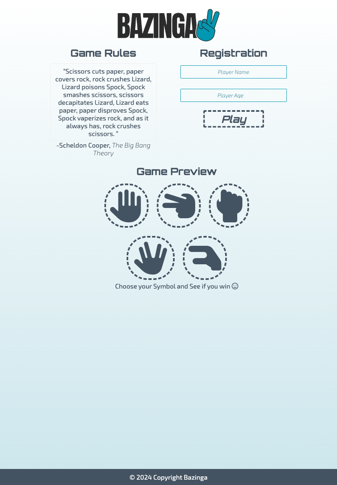</h2> 
        2.  Playing Page iPad Resolution
            <h2>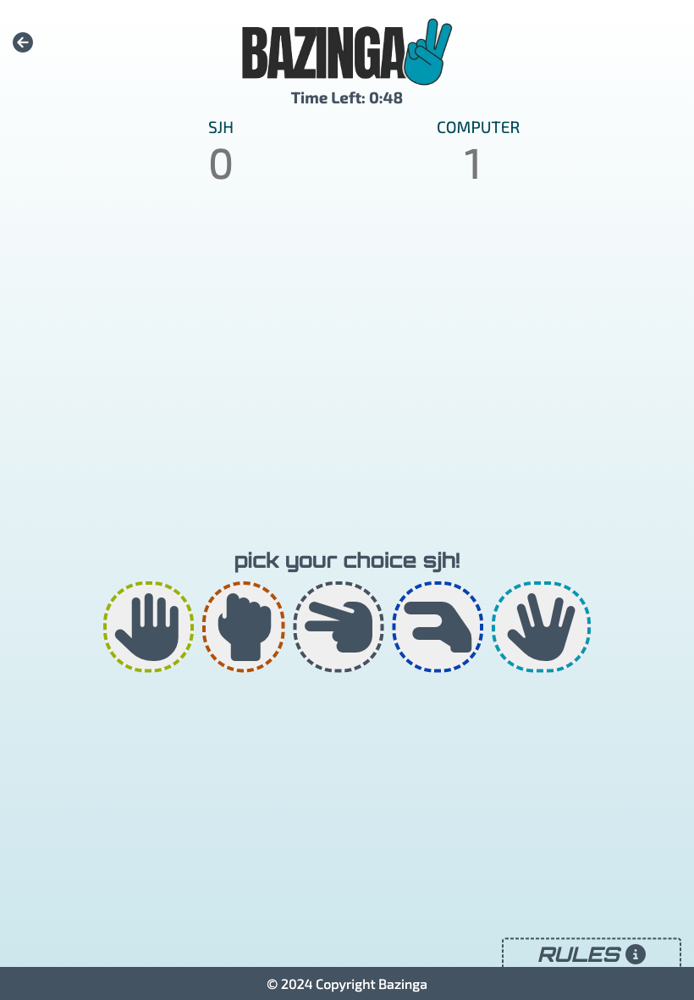</h2> 
        3.  Landing Page Phone Resolution
            <h2>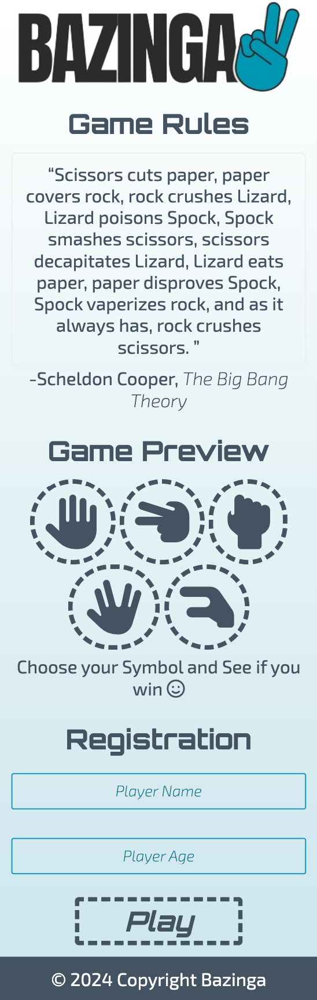</h2> 
        4.  Playing Page Phone Resolution
            <h2></h2> 
            

5. Registration Form Test :
   - Manual Testing: Each field of the registration form was manually tested to verify its usability and responsiveness across different devices and screen sizes.
   - Input Validation Testing: The form was tested to validate that it correctly accepts and rejects inputs according to specified criteria. For example, ensuring that only numeric characters are accepted in the age field and that the age provided is within the acceptable range (between 10 and 85 years).

 

### Google Lighthouse Testing

1. Results
- Desktop-index.html:
  <h2>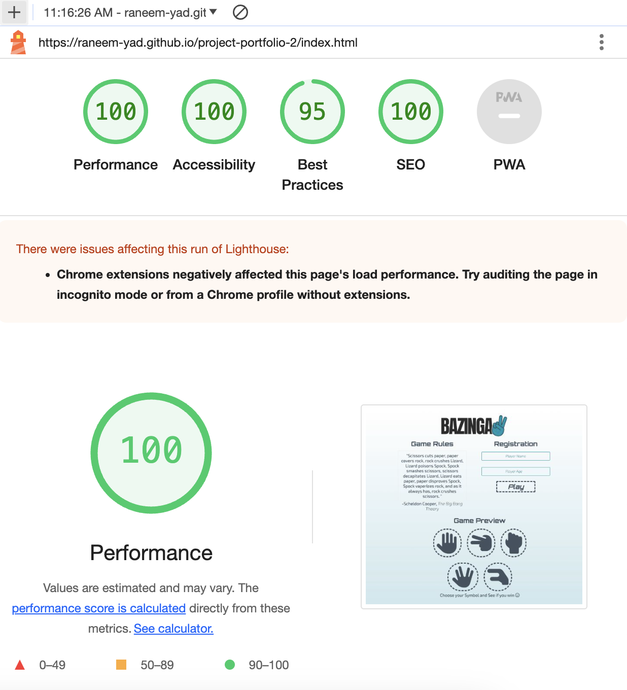</h2>
- Desktop-index.html:
  <h2>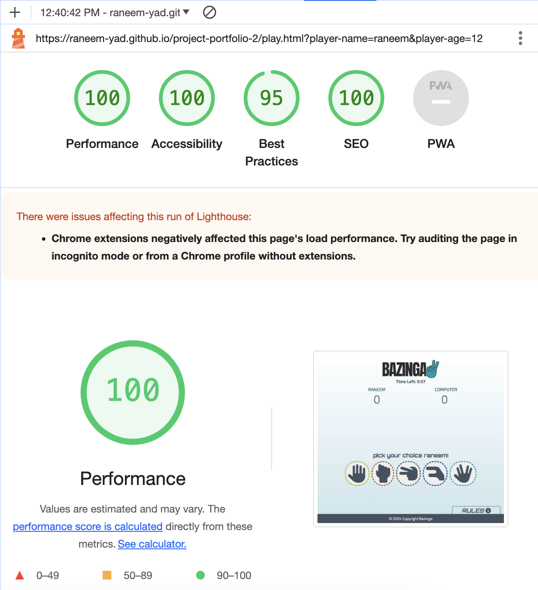</h2>
- Mobile-index.html:
  <h2>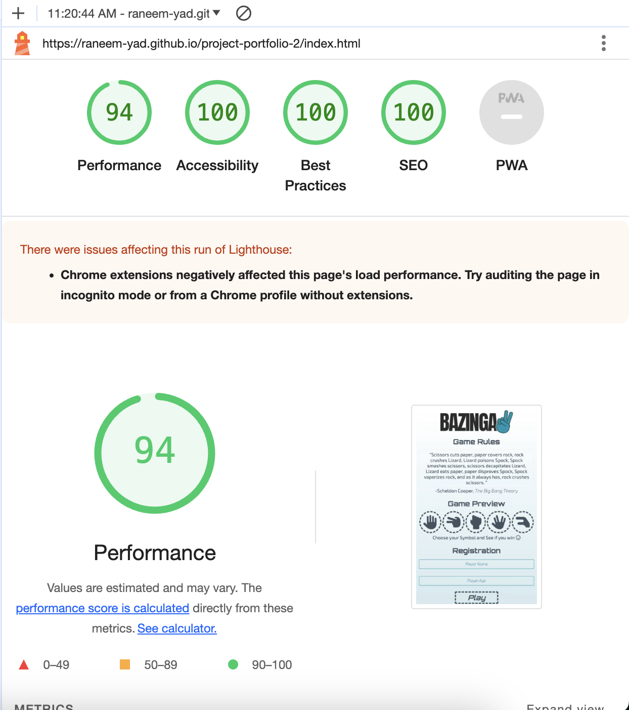</h2>
- Mobile-play.html:
  <h2>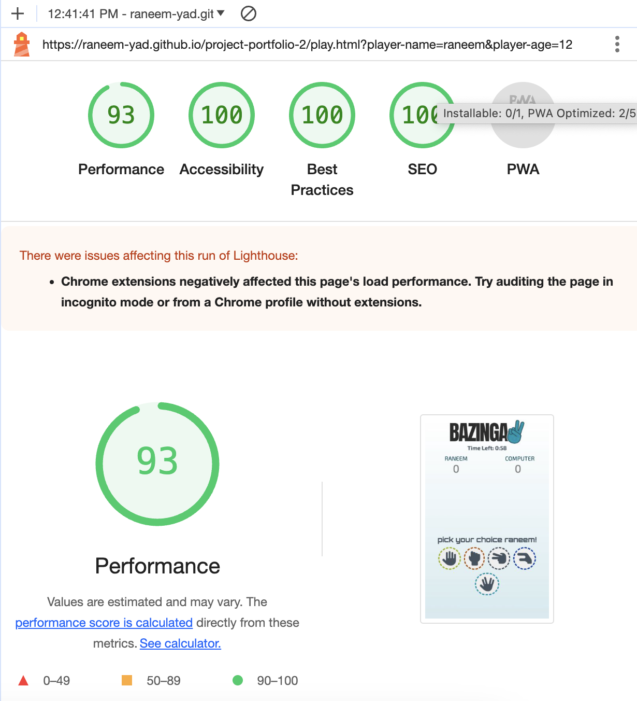</h2>

 

### Further Testing

-   The Website was tested on Google Chrome,  Microsoft Edge, Firefox and Safari browsers.
-   The Website was viewed on a variety of devices such as Desktop, Laptop, iPad and different Android and iOS Phones.
-   Testing was done to ensure that all pages working correctly.
-   Friends were asked to review the site to point out any bugs and/or user experience issues.

 

## Deployment

### GitHub Pages

The project was deployed to GitHub Pages using the following steps...

1. Log in to GitHub and locate the [GitHub Repository](https://github.com/raneem-yad/project-portfolio-2)
2. At the top of the Repository (not the top of the page), locate the "Settings" Button on the menu.
3. Scroll down the Settings page until you locate the "GitHub Pages" Section.
4. Under "Source", click the drop-down called "None" and select "Main Branch".
5. The page will automatically refresh.
6. Scroll back down through the page to locate the now published site [link](https://raneem-yad.github.io/project-portfolio-2/) in the "GitHub Pages" section.

### Forking the GitHub Repository

By forking the GitHub Repository we make a copy of the original repository on our GitHub account to view and/or make changes without affecting the original repository by using the following steps...

1. Log in to GitHub and locate the [GitHub Repository](https://github.com/raneem-yad/project-portfolio-2)
2. At the top of the Repository (not top of page) just above the "Settings" Button on the menu, locate the "Fork" Button.
3. You should now have a copy of the original repository in your GitHub account.

### Making a Local Clone

1. Log in to GitHub and locate the [GitHub Repository](https://github.com/raneem-yad/project-portfolio-2)
2. Under the repository name, click "Clone or download".
3. To clone the repository using HTTPS, under "Clone with HTTPS", copy the link.
4. Open Git Bash
5. Change the current working directory to the location where you want the cloned directory to be made.
6. Type `git clone`, and then paste the URL you copied in Step 3.
7. Press Enter. Your local clone will be created.

Click [Here](https://help.github.com/en/github/creating-cloning-and-archiving-repositories/cloning-a-repository#cloning-a-repository-to-github-desktop) to retrieve pictures for some of the buttons and more detailed explanations of the above process.

 

## Credits

### Project Inspiration: 

-   The concept and idea for this project were inspired by the popular television series The Big Bang Theory, particularly drawing from the iconic references to the game of Rock, Paper, Scissors, Lizard, Spock made by the character Sheldon Cooper.

### Images and Media
-   The website logo was also created by [Developer:Raneem](https://linkedin.com/in/raneem-yad).
-   After creating the logo images were converted to favicon using [Favicon converter](https://favicon.io/favicon-converter/)
 

### Readme

-   The Basic Structure of the Readme was taken from [Code Institute's Sample Readme](https://github.com/Code-Institute-Solutions/SampleREADME/blob/master/README.md).

### Acknowledgements

-   My Mentor for continuous helpful feedback.
-   My husband for supporting me the whole time.
